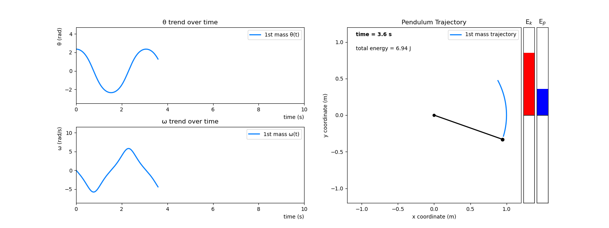
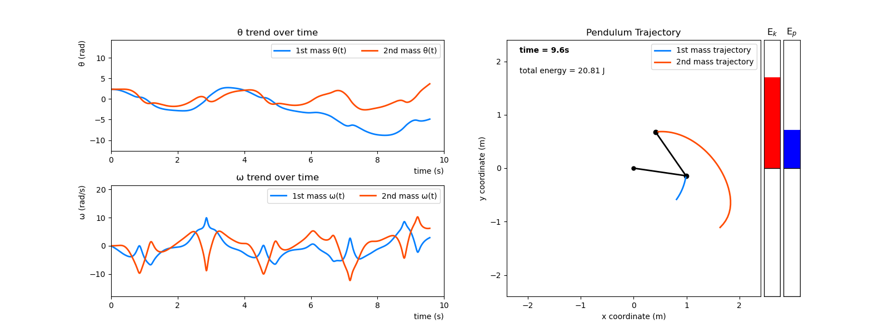
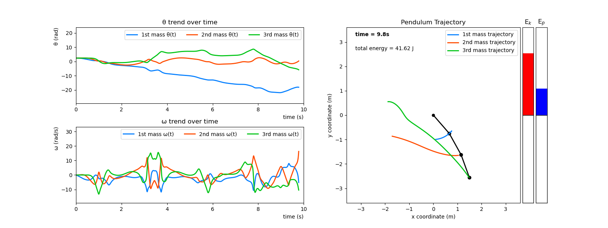

# TriplePendulum Script

The idea behind this script is to give the user a fully customizable system.

## Run the Script

To run the script, simply run the [MAIN.py](./MAIN.py) module 

```
$ python MAIN.py
```

and follow the instructions given.

## User's Choice

* The user can choose whether to work with a

   1. Simple Pendulum
   2. Double Pendulum
   3. Triple Pendulum

* The user can choose wheter to insert values for

    1. Masses of the points
    2. Lengths of the ropes
    3. Initial angles
    4. Intitial angular velocities
    5. Starting time
    6. Ending time
    7. Number of iterations to perform

    Or decide to use default parameters, such as

    1. Masses equal to 1kg
    2. Lengths equal to 1m
    3. Initial angles equal to 135deg
    4. Initial velocities equal to 0deg/s
    5. Starting time equals to 0s
    6. Ending time equals to 10s
    7. Number of iterations equals to 1000

* The user can also choose whether to plot

    1. Static figures
    2. Animated figures

## Modules

### [MAIN.py](./MAIN.py)

coming soon...

### [inputParameters.py](./inputParameters.py)

coming soon...

### [equationsMotion.py](./equationsMotion.py)

coming soon...

### [rungeKutta4.py](./rungeKutta4.py)

coming soon...

### [computeCoordinates.py](./computeCoordinates.py)

coming soon...

### [computeEnergy.py](./computeEnergy.py)

coming soon...

### [figureSetup.py](./figureSetup.py)

coming soon...

### [animationModule.py](./animationModule.py)

coming soon...

### [simplePendulum.py](./simplePendulum.py)

coming soon...

### [doublePendulum.py](./doublePendulum.py)

coming soon...

### [triplePendulum.py](./triplePendulum.py)

coming soon...

## Figures

### Simple Pendulum

* **STATIC**

    

* **ANIMATED**
  
    

### Double Pendulum

* **STATIC**

    

* **ANIMATED**
  
    

### Triple Pendulum

* **STATIC**

    

* **ANIMATED**
  
    

