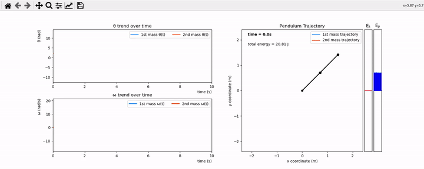

# TriplePendulum Script

The idea behind this script is to give the user a fully customizable system.

## Run the Script

To run the script, simply run the [MAIN.py](./MAIN.py) module 

```
$ python MAIN.py
```

and follow the instructions given.

## User's Choice

* The user can choose whether to work with a

   1. Simple Pendulum
   2. Double Pendulum
   3. Triple Pendulum

* The user can choose whether to insert values for

    1. Masses of the points
    2. Lengths of the ropes
    3. Initial angles
    4. Intitial angular velocities
    5. Starting time
    6. Ending time
    7. Number of iterations to perform

    Or decide to use default parameters, such as

    1. Masses equal to 1kg
    2. Lengths equal to 1m
    3. Initial angles equal to 135deg
    4. Initial velocities equal to 0deg/s
    5. Starting time equals to 0s
    6. Ending time equals to 10s
    7. Number of iterations equals to 1000

* The user can also choose whether to plot

    1. Static figures
    2. Animated figures

## Modules

### [MAIN.py](./MAIN.py)

The [MAIN.py](./MAIN.py) module contains the _main()_ function. It enables the user to choose between the simple, double and triple pendulum system

```python
# Read input from keyboard
try:
    n=int(input('\n'))
except ValueError:
    print('\nMust be a number')
```

and then, depending on the input number, it enters the appropriate function

```python
# Enter the appropriate function
if n == 1:
    simplePendulum(n)
    
elif n == 2:
    doublePendulum(n)

elif n == 3:
    triplePendulum(n)

else:
    print('Not supported')
```

### [inputParameters.py](./inputParameters.py)

The [inputParameters.py](./inputParameters.py) module contains the _inputParameters(n)_ function, which requires as argument the integer _n_ assigned in the _main()_ function and holding the information about the system (1 = simple pendulum, 2 = double pendulum, 3 = triple pendulum). 

Inside the _inputParameters(n)_ function, a temporary parameter array, the initial conditions array and the simulation time constraints array are filled as follows

```python
# Fill the p array with masses
for i in range(n):    
    p[i] = float(input('\nInsert mass for point %1.0f: ' % (i+1)))
# Fill the p array with lengths
for j in range(n):
    p[j+n] = float(input('\nInsert length for rope %1.0f: ' % (j+1)))
    
# Fill the q0 array with initial angles
for k in range(n):
    q0[2*k] = np.radians(float(input('\nInsert initial angle of point %1.0f (in deg): ' % (k+1))))

# Fill the q0 array with initial velocities
for l in range(n):
    q0[2*l + 1] = np.radians(float(input('\nInsert initial angular velocity of point %1.0f (in deg/s): ' % (l+1))))

# Fill the simTime array with the starting time, ending time and the number of iterations to perform
simTime[0] = int(input("\nInsert starting time: "))
simTime[1] = int(input("\nInsert ending time: "))
simTime[2] = int(input('\nInsert number of iterations: '))
```

Finally, a comprehensive parameter list is created and returned

```python
# Create the parameters list
par = [*p, q0, *simTime]

return par
```


### [equationsMotion.py](./equationsMotion.py)

coming soon...

### [rungeKutta4.py](./rungeKutta4.py)

coming soon...

### [computeCoordinates.py](./computeCoordinates.py)

coming soon...

### [computeEnergy.py](./computeEnergy.py)

coming soon...

### [figureSetup.py](./figureSetup.py)

coming soon...

### [animationModule.py](./animationModule.py)

coming soon...

### [simplePendulum.py](./simplePendulum.py)

coming soon...

### [doublePendulum.py](./doublePendulum.py)

coming soon...

### [triplePendulum.py](./triplePendulum.py)

coming soon...

## Figures

### Simple Pendulum

* **STATIC**

    

* **ANIMATED**
  
    

### Double Pendulum

* **STATIC**

    

* **ANIMATED**
  
    
    
    
    
    
    
    

### Triple Pendulum

* **STATIC**

    

* **ANIMATED**
  
    
    
    
    
    
    
    

